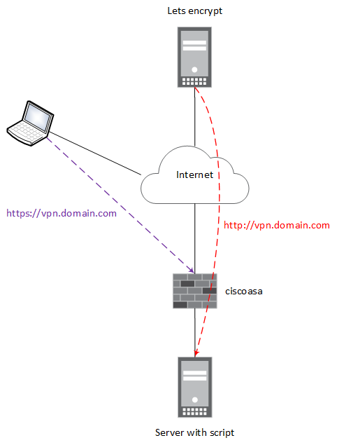

This script requests certificate from letsencrypt.org and installs it on cisco asa. Tested with python 2.7

# Requirements
Suppose you have vpn.domain.com. URL https://vpn.domain.com reserved for Cisco 'Anyconnect' portal and for connection to vpn with 'Anyconnect' client.
http://vpn.domain.com are server, where script will be used.


Software:
1. Cisco ASA 9.6.3(1) and higher
2. Rest API 1.3.0 and higher
3. Python 2.7

The script uses webroot method for check you are owner of domain name. 

# Installation Centos 7
-------------------------------------------------------------------------
## Preparing.
Cisco asa:
```bash
ciscoasa(config)# boot system disk0:/asa963-17-smp-k8.bin
ciscoasa(config)# rest-api image disk0:/asa-restapi-132100-lfbff-k8.SPA
ciscoasa(config)# rest-api agent
```

Script-machine:
```bash
[netadmin@server]# yum install nginx certbot -y
[netadmin@server]# mkdir -p /var/www/html/letsencrypt
[netadmin@server]# cat <<EOF >> /etc/nginx/conf.d/vpn.domian.com.conf
server {
    listen       80;
    server_name  vpn.domain.com;
    location ~ /\.well-known {
        root /var/www/html/letsencrypt/;
    }
}
EOF
[netadmin@server]# systemctl enable nginx
[netadmin@server]# systemctl start nginx
```
## Getting script

```bash
git clone https://github.com/nomyownnet/ca-asa-install.git
or
curl -O https://github.com/nomyownnet/ca-asa-install/archive/master.zip
```

## Filling config file

```bash
[options]
# Management ip address of cisco asa 
ipaddress = 10.0.0.1 
# Credentionals. Be sure, that your account has admin rights.
username = admin
password = P@ssw0rd
# Port of admin portal cisco asa, not vpn.
port = 443
# Password for pkcs12. Be sure, that it's not 'root' or 'qwerty'
secret = Passforca!23
# Interface cisco asa, on which anyconnect works. 
interface = inside
domain = vpn.domain.com
# Path to private key, cert and chain. Default value for Centos 7.
certpath = /etc/letsencrypt/live/vpn.domain.com/
# Path for check domain name
webroot = /var/www/html/letsencrypt/
# Getting test certificate.
testcert = False
# Import certificate to cisco asa with or without pinning to interface 
pin = True
```

## Run script
```bash
[netadmin@server]# ./certinstall.py
Status code is 201
Create was successful
Status code is 200
```
## Verifying
The script creates trustpoint with current date as a name.

```bash
ciscoasa# sh crypto ca certificate trustpoint_name
Certificate
  Status: Available
  Certificate Serial Number: 00fac88ca26cf89ef77ad256e2ddbbcf1eb919
  Certificate Usage: General Purpose
  Public Key Type: RSA (2048 bits)
  Signature Algorithm: SHA256 with RSA Encryption
  Issuer Name:
    cn=Fake LE Intermediate X1
  Subject Name:
    cn=vpn.domain.com
  OCSP AIA:
    URL: http://ocsp.stg-int-x1.letsencrypt.org
  Validity Date:
    start date: 22:58:35 MSK Dec 3 2017
    end   date: 22:58:35 MSK Mar 3 2018
  Associated Trustpoints: 20171204

CA Certificate
  Status: Available
  Certificate Serial Number: 008be12a0e5944ed3c546431f097614fe5
  Certificate Usage: Signature
  Public Key Type: RSA (2048 bits)
  Signature Algorithm: SHA256 with RSA Encryption
  Issuer Name:
    cn=Fake LE Root X1
  Subject Name:
    cn=Fake LE Intermediate X1
  OCSP AIA:
    URL: http://ocsp.stg-root-x1.letsencrypt.org/
  Validity Date:
    start date: 01:07:59 MSK May 24 2016
    end   date: 01:07:59 MSK May 24 2036
  Associated Trustpoints: 20171204 20171129

ciscoasa# show run | i trust
... <truncated output>...
crypto ca trustpoint trustpoint_name
... <truncated output>...
ssl trust-point trustpoint_name vpn_interface
... <truncated output>...
```

## Possible errors
1. TrustPoint 'trustpoint_name' name is already assigned with CA certificate
```bash
Error received from server. HTTP Status code :400
{
    "messages": [
        {
            "code": "INVALID-INPUT",
            "context": "name",
            "details": "TrustPoint 'trustpoint_name' name is already assigned with CA certificate.",
            "level": "Error"
        }
    ]
}
```
Delete trustpoint from cisco asa.
```bash
ciscoasa(config)#no crypto ca trustpoint 20171203 noconfirm
```
2. Keypair name VPN_TP_Sep2013 already exist
Delete keypair from cisco asa.
```bash
ciscoasa(config)# no crypto key zeroize rsa label trustpoint_name noconfirm
```

